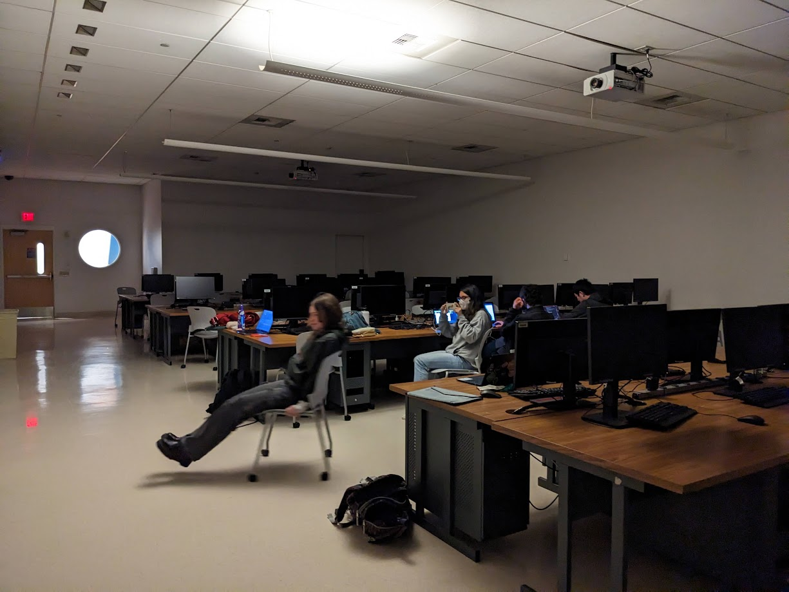

# Molly MacLaren

## Index
1. [Intro](#intro)
2. [My Interests](#my-interests)
3. [Code that I like](#code-that-i-like)
4. [Screenshots](#screenshots)
5. [Checklist](#checklist)


## Intro
Hi, I'm **Molly**! I am a second year computer engineering major in the ECE department at *UC San Diego.* I enjoy long walks on the beach and late nights in the CSE basement. Check out my [main website](https://mojeanmac.github.io/).

## My Interests
### A few things I like are:
- social computing
- cybersecurity
- rock climbing
- petting cats

## Code that I like
**Code Golfing** is a fun challenge that involves writing the shortest possible code to solve a certain problem. For example, here is a program to play rock paper scissors against the computer using Python 3's default hash randomization in *55 bytes*:
```
q={*'rps'}.pop()
print(q,'rrppssrpsr'.count(q+input()))
```
[Source](https://codegolf.stackexchange.com/a/215372)

## Screenshots
[add-read-me](screenshots/add.png)

[ignore](screenshots/ignore.png)

[Staged commits](screenshots/stage.png)

## Checklist
At the time of completing this assignment, my friends and I were cooking Japanese curry for dinner. These are the steps we followed:
- [X] Chopping vegetables
- [X] Sauteing vegetables
- [X] Getting someone go to the store because we forgot meat
- [X] Sauteing meat
- [X] Adding water
- [X] Adding curry cubes to boiling pot
- [ ] Start rice

> We forgot to start the rice.